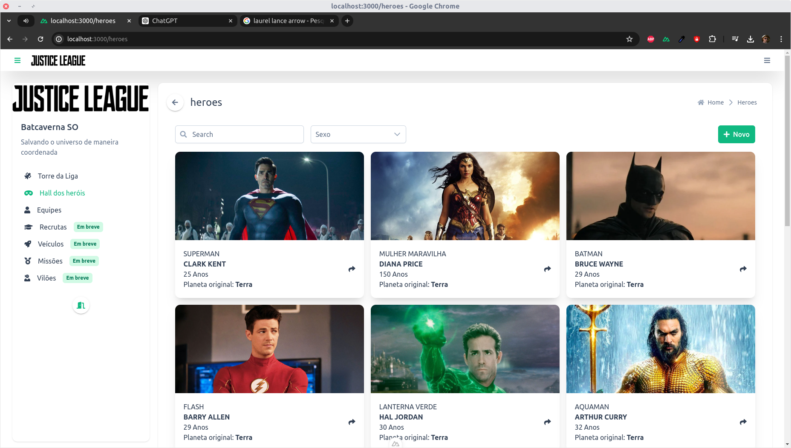
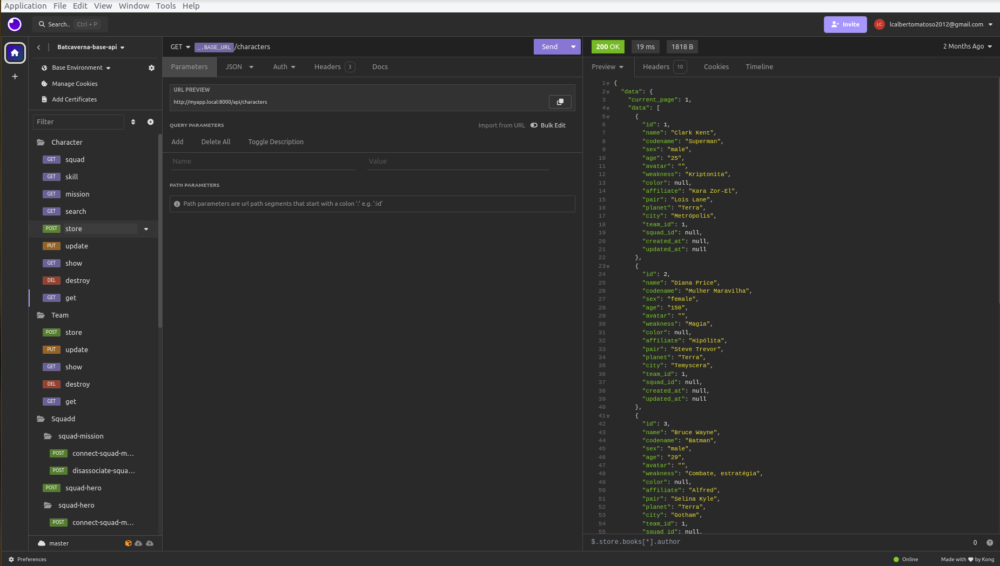

<p align="center"><a href="https://laravel.com" target="_blank">
</a></p>
<h1 align="center">🦇BATCAVERNA API🦇</h1>

<div>
    
    
    
    
    
    
    

</div>

## O sistema usado pelo Batman e pela Liga da Justiça em suas missões!

Gerencie seus heróis em missão de maneira organizada, Acompanhe seus squads em frentes de batalha.<br>


<br>
O projeto ainda está em desenvolvimento, então se sinta a vontade para criar uma issue reportar um bug, um fork ou pull
request.

## API

Desenvolvido em Laravel 7. Será necessárip clonar o [repositório](https://github.com/lcAlberto/batcaverna-api) para
testar

## Setup

### Configure o `.env`

```bash
# bash
cp env.example .env
```

```bash
# .env
NUXT_PUBLIC_API_BASE= 'url-da-api'
NUXT_PUBLIC_API_SECRET='key-gerada-pela-api'
```

### Instalar as dependências

```bash
# npm
npm install
```

## Rodando o servidor

Start the development server on `http://localhost:3000`:

```bash
# npm
npm run dev
```

## Em produção

Para o deploy

```bash
# npm
npm run build
```

## Importando Endpoints no Insomnia

Para importar a coleção de endpoints no Insomnia, siga os passos abaixo:

1. A colection de endpoints se encontra na raiz do projeto, em `endpoints/Insomnia_endpoints_doc.json`.
2. No Insomnia, clique em `Import/Export` (ícone no canto superior direito).
3. Selecione `Import Data` e, em seguida, `From File`.
4. Escolha o arquivo `endpoints/Insomnia_endpoints_doc.json` na raiz do projeto.



Após a importação, você verá todos os endpoints disponíveis para teste.

# Planos em desenvolvimento

- Criei um board no [Trelo](https://trello.com/) com as features pendentes e as features que estou trabalhando para que
  o projeto sempre evolua. Ele pode ser
  encontrado [aqui](https://trello.com/invite/b/6695fa4f12ec2d55297e363f/ATTIbd3b5c47858fa18b0145622348c9cee9F514C36F/batcaverna-api).
- Criar testes unitários
- Aplicar técnicas de padrões de projetos

## License

The Laravel framework is open-sourced software licensed under the [GPL](LICENSE.md).

Veja mais sobre deploy na documentação oficial do
nuxt [deployment documentation](https://nuxt.com/docs/getting-started/deployment).
